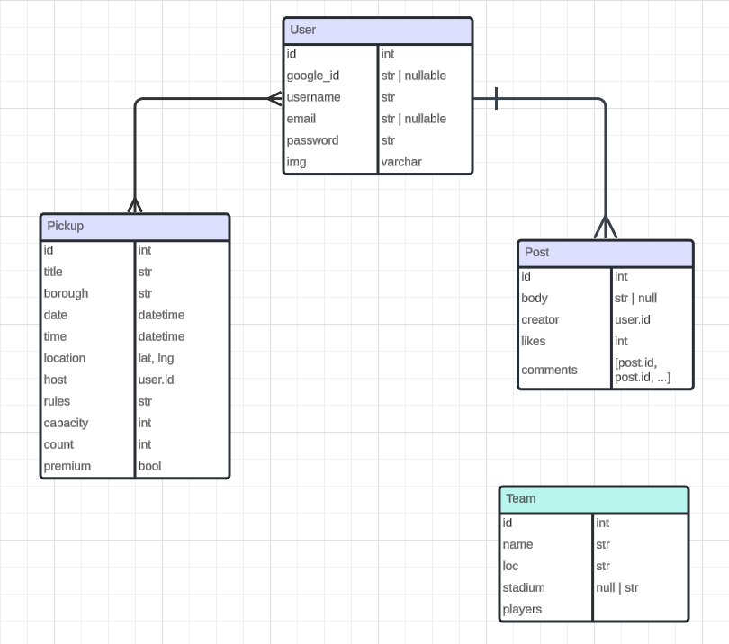

# Entity Relationship Diagram

## Database Tables

### Users
| Column Name | Type | Description |
|-------------|------|-------------|
| id | serial | Primary key |
| google_id | varchar(50) | Google OAuth ID (nullable) |
| username | varchar(100) | Username (not null) |
| email | varchar(255) | User email (not null, unique) |
| password | varchar(255) | Hashed password (nullable for Google auth) |
| img | varchar(500) | Profile image URL (nullable) |

### Posts
| Column Name | Type | Description |
|-------------|------|-------------|
| id | serial | Primary key |
| body | text | Post content (nullable) |
| creator_id | int | Foreign key -> users.id |
| likes | int | Number of likes |
| comments | jsonb | Array of post IDs representing comments |

### Pickups
| Column Name | Type | Description |
|-------------|------|-------------|
| id | serial | Primary key |
| title | varchar | Game title |
| borough | varchar | NYC borough location |
| date | timestamp | Game date |
| time | timestamp | Game time |
| location | point | Latitude and longitude |
| host | int | Foreign key -> users.id |
| rules | text | Game rules and info |
| capacity | int | Maximum players |
| count | int | Current player count |
| premium | boolean | Premium/free game indicator |

## Relationships

1. **Users to Posts**
   - One-to-Many: A user can create multiple posts
   - Foreign key: posts.creator_id references users.id

2. **Users to Pickups**
   - One-to-Many: A user can host multiple pickup games
   - Foreign key: pickups.host references users.id

3. **Posts to Pickups**
   - One-to-One: Each game post has one pickup game entry

4. **Posts to Posts (Comments)**
   - Many-to-Many: Posts can have multiple comment posts
   - Implemented through posts.comments array

