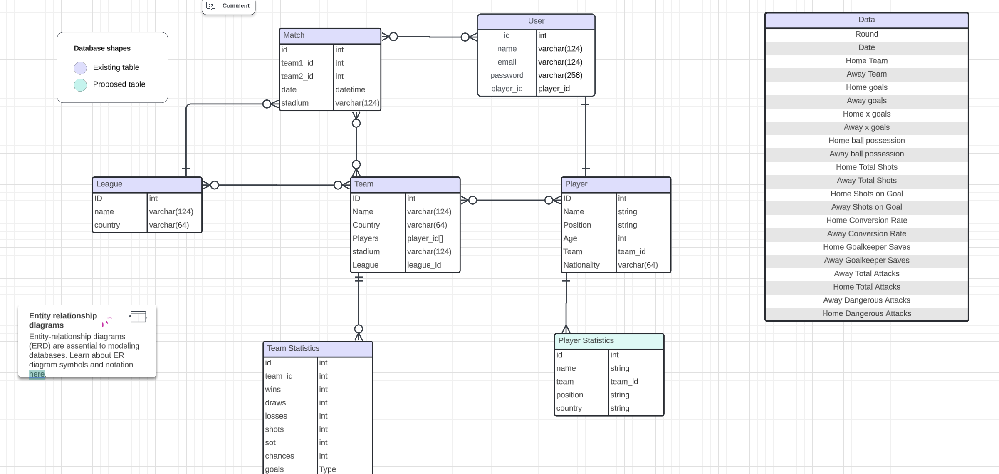

# Entity Relationship Diagram

Reference the Creating an Entity Relationship Diagram final project guide in the course portal for more information about how to complete this deliverable.

## Create the List of Tables

### User
| Column Name | Type | Description |
|-------------|------|-------------|
| id | int | primary key |
| name | text | username |
| email | text | user email. not null |
| password | text | user password. not null |
| premium | bool | field that says if the user is a premium user |

### Pickups
| Column Name | Type | Description |
|-------------|------|-------------|
| id | int | primary key |
| location | text | pickup location |
| date | datetime | pickup date |
| capacity | int | player capacity |
| creator_id | user.id | pickup game creator |

### Pickups_Users
This table is intended to connect a pickup game with all the signed-up users
Note: Each instance represents one relationship. There might be multiple instances of entries with the same pickup_id, but only one entry with a combination of a user instance and a pickup instance
| Column Name | Type | Description |
|-------------|------|-------------|
| pickup_id | pickup.id | foreign key to pickup game |
| user_id | user.id | forgeign key to a user |

### Team
| Column Name | Type | Description |
|-------------|------|-------------|
| id | integer | primary key |
| name | text | name of the soccer team |
| country | text | team home country |
| players | [player1_id, player2_id, ...] | an array of foreign keys of all the players in the team. not null |
| stadium | text | team stadium name |
| league | league_id | [league1_id, league2_id, ...] an array of foreign keys of all leagues the team belongs. default null |

### League
| Column Name | Type | Description |
|-------------|------|-------------|
| id | int | primary key |
| name | text | player name |
| country | text | user nationality |

### Match 
| Column Name | Type | Description |
|-------------|------|-------------|
| id | int | primary key |
| team1_id | team_id | foreign key to team instance for home team. default null |
 team2_id | team_id | foreign key to team instance for away team. default null |

# Entity Relationship Diagram

Reference the Creating an Entity Relationship Diagram final project guide in the course portal for more information about how to complete this deliverable.

## Create the List of Tables

### Player
| Column Name | Type | Description |
|-------------|------|-------------|
| id | int | primary key |
| name | text | player name |
| position | text | player position. default null |
| age | int | user age |
| country | text | user nationality |
| team | team_id | foreign key to team. default null |

### User
| Column Name | Type | Description |
|-------------|------|-------------|
| id | int | primary key |
| name | text | username |
| email | text | user email. not null |
| password | text | user password. not null |
| player_id | player_id | foreign key to user player profile. not null. each user gets signed up as a player |

### Team
| Column Name | Type | Description |
|-------------|------|-------------|
| id | integer | primary key |
| name | text | name of the soccer team |
| country | text | team home country |
| players | [player1_id, player2_id, ...] | an array of foreign keys of all the players in the team. not null |
| stadium | text | team stadium name |
| league | league_id | [league1_id, league2_id, ...] an array of foreign keys of all leagues the team belongs. default null |

### League
| Column Name | Type | Description |
|-------------|------|-------------|
| id | int | primary key |
| name | text | player name |
| country | text | user nationality |

### Match 
| Column Name | Type | Description |
|-------------|------|-------------|
| id | int | primary key |
| team1_id | team_id | foreign key to team instance for home team. default null |
 team2_id | team_id | foreign key to team instance for away team. default null |

